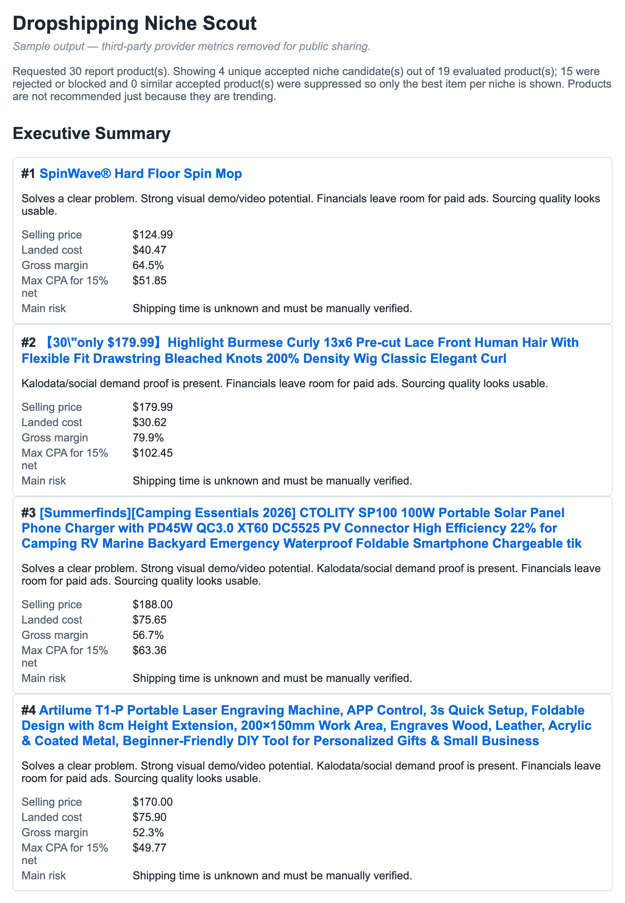

# dropship-codex

A local product-research pipeline for e-commerce / dropshipping. It sources trending
products, cross-checks demand and competition across multiple platforms, scores each
candidate against configurable financial and risk criteria, and generates a ranked
HTML + Markdown report.

The whole pipeline runs on your own machine using headless [Playwright](https://playwright.dev)
browser sessions — no third-party API keys required.

## Sample output

The runner produces a ranked report with per-product economics (selling price, landed
cost, gross margin, max CPA) and a plain-English rationale and risk note for each pick.



## How it works

```
Source  ──►  Validate  ──►  Score  ──►  Report
(demand)     (demand +       (financials    (ranked
             competition)     + risk)         HTML / MD)
```

1. **Source** — collect a pool of trending candidate products.
2. **Validate** — for each candidate, cross-check social demand and existing
   competition across platforms in batches.
3. **Score** — apply financial thresholds (margin, CPA) and risk rules
   (`src/product-scoring.mjs`), dropping official-shop / branded items and swapping in
   meaningful alternatives where possible.
4. **Report** — emit a ranked report to `output/research-report.html` and
   `output/research-report.md`, deduped so only the best item per niche is shown.

Key modules:

| File | Responsibility |
| --- | --- |
| `src/research-runner.mjs` | Orchestrates the full pipeline (entry point) |
| `src/kalodata.mjs` | Sources the candidate product pool |
| `src/tiktok.mjs`, `src/facebook-ads.mjs`, `src/aliexpress.mjs` | Demand & competition signals |
| `src/product-scoring.mjs` | Financial + risk scoring |
| `src/competition.mjs`, `src/alternatives.mjs` | Competition analysis & alternative sourcing |
| `src/report.mjs` | Builds the HTML / Markdown report |
| `src/login.mjs` | Interactive login helper that saves browser sessions |

## Requirements

- Node.js 18+
- Playwright browser binaries (installed in setup below)
- Accounts on any data sources you want to use (you log in interactively; sessions are
  stored locally in `profiles/` and are **never** committed — see [Security](#security))

## Setup

```bash
# 1. Install dependencies
npm install

# 2. Install the Playwright browser
npx playwright install chromium

# 3. Create your config from the template
cp .env.example .env
```

> **Note:** `src/login.mjs` and `src/run-with-kalodata.mjs` currently hardcode an
> absolute `ROOT` path (`/Users/dadski/Projects/dropship-codex`). Update that constant
> to your local checkout path before running.

## Usage

### 1. Log in to your data sources (one time, or when sessions expire)

Each command opens a browser window; sign in manually, then press Enter in the terminal
to save the session locally.

```bash
npm run login:all          # log in to every source
# — or individually —
npm run login:kalodata
npm run login:facebook
npm run login:aliexpress
npm run login:tiktok
```

### 2. Run the research pipeline

```bash
npm run research           # run with saved sessions
npm run full               # log in to everything, then run
npm run run:visible        # run with the browser window visible (useful for debugging)
```

The report is written to:

- `output/research-report.html`
- `output/research-report.md`

Open the HTML file in a browser to view the ranked results.

### 3. Manage the product blacklist

Products you never want surfaced are stored in `config/product-blacklist.json`.

```bash
npm run blacklist:list
npm run blacklist:add
npm run blacklist:remove
```

## Configuration

All tuning is done via environment variables in `.env` — see `.env.example` for the full
list. Common ones:

| Variable | Purpose | Default |
| --- | --- | --- |
| `REPORT_PRODUCT_LIMIT` | Number of accepted products in the report | `5` |
| `KALODATA_PRICE_MIN` / `KALODATA_PRICE_MAX` | Price band for sourcing | unset |
| `KALODATA_REVENUE_MIN` / `KALODATA_REVENUE_MAX` | Revenue band for sourcing | unset |
| `VISIBLE_BROWSER` | Show the browser while running (`1`/`0`) | `0` |

## Security

This project logs into third-party accounts and stores the resulting **browser sessions
locally**. The following are git-ignored and must never be committed:

- `profiles/` — Chromium profiles containing live login cookies for your accounts
- `.env` — your configuration
- `output/` — generated reports and scraped intermediate data

Before pushing, confirm `git status` shows none of the above.

## Disclaimer

Built as a personal research and automation project. Respect the terms of service of any
platform you connect it to, and treat all output as a starting point for your own
diligence — not a recommendation. The report itself notes: *products are not recommended
just because they are trending.*
